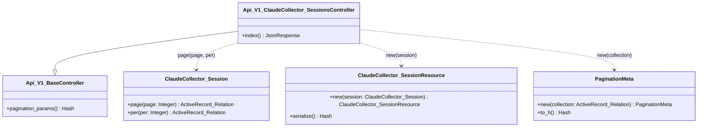
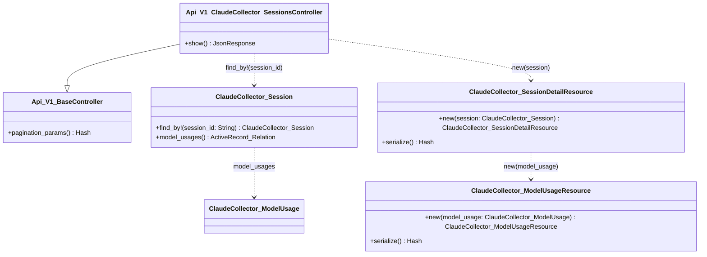
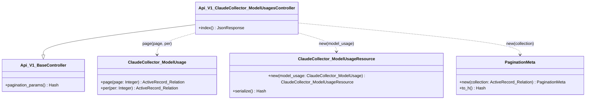

## 変更履歴

- v1.0 (2026-02-25): 初版作成
- v1.1 (2026-02-25): Auditorレビューに基づき実装構成要素を修正（モデル別利用量一覧にModelUsageResource追加、各エンドポイントに既存モデルを種別「既存」として追記）
- v1.2 (2026-02-25): ユーザーフィードバック反映（FUNC-003: simplecov minimum_coverage 100% を設計方針として明記、FUNC-008: パラメータを主キー id から session_id カラムに変更）
- v1.3 (2026-02-25): Auditorレビューに基づきセッション詳細クラス図にClaudeCollector_ModelUsageクラス定義と関係線を追加
- v1.4 (2026-02-25): FUNC-001（コーディングルールファイル作成）を開発順序の先頭に移動（実装時のルール基盤となるため）
- v1.5 (2026-02-25): FUNC-ID リナンバリング（コーディングルールファイル作成を FUNC-001 とし、開発順序に合わせて全 FUNC-ID を FUNC-001〜009 に振り直し）

## 概要

### 要件定義概要

apps/rails に対して、claude-collector が収集した利用統計データを参照する API エンドポイント群を実装する。同時に、テスト基盤（rspec / simplecov）、API ドキュメント生成（rswag）、JSON シリアライザ（alba）、ページネーション（kaminari）を導入し、aitally 向けコーディングルールファイル 7 種を配置する。

### 設計目的

* テスト・ドキュメント・シリアライズ・ページネーション基盤の確立: 各 gem を導入し、開発サイクルに組み込む方針を定める
* 参照 API の設計: セッション一覧・詳細、モデル別利用量一覧の 3 エンドポイントの構造を定める
* コーディングルールの体系化: レイヤー構造に基づく責務分離ルールを含む 7 種のドキュメントの構成と配置方針を定める

### スコープ

* rspec / simplecov / rswag / alba / kaminari の導入設定
* Minitest から rspec への移行（test/ ディレクトリ廃止、rails/test_unit/railtie の除去）
* セッション一覧取得 API（GET /api/v1/claude_collector/sessions）
* セッション詳細取得 API（GET /api/v1/claude_collector/sessions/:session_id）
* モデル別利用量一覧取得 API（GET /api/v1/claude_collector/model_usages）
* コーディングルールファイル 7 種の作成・配置
* 既存コードを含むアプリケーション全体でテストカバレッジ 100% の維持

## データモデル設計

### Session 詳細設計

**テーブル名**: `sessions`（claude_collector データベース、参照専用）

**カラム定義**:
- id: bigint, NOT NULL, 自動採番 - 主キー
- session_id: string, NOT NULL - Claude セッション識別子
- project_path: string, NOT NULL - プロジェクトパス
- cost_usd: decimal(12,6), NULL - コスト（USD）
- total_input_tokens: bigint, NULL - 入力トークン合計
- total_output_tokens: bigint, NULL - 出力トークン合計
- total_cache_creation_input_tokens: bigint, NULL - キャッシュ作成入力トークン合計
- total_cache_read_input_tokens: bigint, NULL - キャッシュ読取入力トークン合計
- total_web_search_requests: integer, NULL - Web検索リクエスト合計
- duration_ms: bigint, NULL - セッション時間（ms）
- api_duration_ms: bigint, NULL - API応答時間（ms）
- lines_added: integer, NULL - 追加行数
- lines_removed: integer, NULL - 削除行数
- created_at: datetime, NOT NULL - 作成日時
- updated_at: datetime, NOT NULL - 更新日時

**インデックス**:
- index_sessions_on_session_id: session_id, ユニーク=YES - セッション識別子の一意性保証
- index_sessions_on_project_path: project_path, ユニーク=NO - プロジェクトパス検索用

**バリデーション**:
- 該当なし（参照専用のためアプリケーション層でのバリデーションは不要）

### ModelUsage 詳細設計

**テーブル名**: `model_usages`（claude_collector データベース、参照専用）

**カラム定義**:
- id: bigint, NOT NULL, 自動採番 - 主キー
- session_id: bigint, NOT NULL - 外部キー（sessions.id）
- model_id: string, NOT NULL - モデル識別子
- input_tokens: bigint, NULL - 入力トークン
- output_tokens: bigint, NULL - 出力トークン
- cache_read_input_tokens: bigint, NULL - キャッシュ読取入力トークン
- cache_creation_input_tokens: bigint, NULL - キャッシュ作成入力トークン
- web_search_requests: integer, NULL - Web検索リクエスト数
- cost_usd: decimal(12,6), NULL - コスト（USD）
- created_at: datetime, NOT NULL - 作成日時
- updated_at: datetime, NOT NULL - 更新日時

**インデックス**:
- index_model_usages_on_session_id_and_model_id: [session_id, model_id], ユニーク=YES - セッション・モデルの組み合わせ一意性保証

**バリデーション**:
- 該当なし（参照専用のためアプリケーション層でのバリデーションは不要）

### 既存モデルの変更

- ClaudeCollector::Session: 変更なし（既存の has_many :model_usages をそのまま利用）
- ClaudeCollector::ModelUsage: 変更なし（既存の belongs_to :session をそのまま利用）
- ClaudeCollectorRecord: 変更なし（抽象クラス、claude_collector データベースへの接続設定済み）

## 実装構成要素

### 共通コンポーネント

複数のエンドポイントで共有されるコンポーネント。

- PaginationMeta: `app/presenters/pagination_meta.rb`, ページネーションメタ情報のレスポンス構造定義, 新規
- Api::V1::BaseController: `app/controllers/api/v1/base_controller.rb`, API v1 共通の基底コントローラ（エラーハンドリング、ページネーションパラメータ処理）, 新規

### GET /api/v1/claude_collector/sessions（セッション一覧）

- メソッド: GET
- パス: /api/v1/claude_collector/sessions
- 概要: セッション一覧をページネーション付きで取得
- 認証: 不要

**コンポーネント**:
- ClaudeCollector::Session: `app/models/claude_collector/session.rb`, Claude セッション情報, 既存
- ClaudeCollector::SessionResource: `app/resources/claude_collector/session_resource.rb`, セッションの JSON シリアライズ定義, 新規
- Api::V1::ClaudeCollector::SessionsController: `app/controllers/api/v1/claude_collector/sessions_controller.rb`, セッション一覧・詳細の HTTP リクエスト処理, 新規

### GET /api/v1/claude_collector/sessions/:session_id（セッション詳細）

- メソッド: GET
- パス: /api/v1/claude_collector/sessions/:session_id
- 概要: 指定された session_id（Claude セッション識別子）のセッション詳細情報をモデル別利用量とともに取得
- 認証: 不要

**コンポーネント**:
- ClaudeCollector::Session: `app/models/claude_collector/session.rb`, Claude セッション情報, 既存
- ClaudeCollector::ModelUsage: `app/models/claude_collector/model_usage.rb`, モデル別利用量情報, 既存
- ClaudeCollector::SessionDetailResource: `app/resources/claude_collector/session_detail_resource.rb`, セッション詳細（モデル別利用量含む）の JSON シリアライズ定義, 新規
- ClaudeCollector::ModelUsageResource: `app/resources/claude_collector/model_usage_resource.rb`, モデル別利用量の JSON シリアライズ定義, 新規
- Api::V1::ClaudeCollector::SessionsController: `app/controllers/api/v1/claude_collector/sessions_controller.rb`, （一覧と同一コントローラ）, 新規

### GET /api/v1/claude_collector/model_usages（モデル別利用量一覧）

- メソッド: GET
- パス: /api/v1/claude_collector/model_usages
- 概要: モデル別利用量一覧をページネーション付きで取得
- 認証: 不要

**コンポーネント**:
- ClaudeCollector::ModelUsage: `app/models/claude_collector/model_usage.rb`, モデル別利用量情報, 既存
- ClaudeCollector::ModelUsageResource: `app/resources/claude_collector/model_usage_resource.rb`, モデル別利用量の JSON シリアライズ定義, 新規
- Api::V1::ClaudeCollector::ModelUsagesController: `app/controllers/api/v1/claude_collector/model_usages_controller.rb`, モデル別利用量一覧の HTTP リクエスト処理, 新規

### クラス図

**目的**: クラス間の関係性とパラメータの流れを視覚的に表現し、実装時のインターフェース齟齬を防ぐ

#### GET /api/v1/claude_collector/sessions（セッション一覧）

#### GET /api/v1/claude_collector/sessions/:session_id（セッション詳細）

#### GET /api/v1/claude_collector/model_usages（モデル別利用量一覧）

**実装方針**:
- API バージョニングは URL パス方式（/api/v1/）を採用し、名前空間でコントローラを整理する
- JSON シリアライズは alba の Resource パターンを採用し、app/resources/ 配下に配置する。alba のネーミング慣例に従い Serializer ではなく Resource と命名する
- ページネーションは kaminari が提供する page/per スコープを利用し、メタ情報は PaginationMeta プレゼンタで構造化する
- セッション詳細の関連モデル別利用量は、alba の nested resource（has_many）で表現する
- コントローラは参照専用のため、index / show アクションのみを定義する
- エラーハンドリングは ActiveRecord::RecordNotFound を rescue_from で捕捉し、404 レスポンスを返す
- 参照専用の担保として、コントローラに index / show のみ定義し、ルーティングでも only: [:index, :show] で制限する

**テスト方針**:
- 各コンポーネントには対応するテストを含めること
- テストファイルのパスと命名規則: spec/ 配下に Rails 標準の rspec ディレクトリ構成（spec/requests/, spec/resources/, spec/presenters/, spec/models/）を採用
- rswag の request spec 形式で API テストを記述し、OpenAPI ドキュメント生成と結合する
- 既存の ApplicationController, ApplicationRecord, ClaudeCollectorRecord, ClaudeCollector::Session, ClaudeCollector::ModelUsage のテストも含め、アプリケーション全体でカバレッジ 100% を達成する

## 影響範囲

### 技術スタック依存

- Gemfile: rspec-rails, simplecov, rswag, alba, kaminari の追加
- Minitest 関連: test/ ディレクトリの廃止、config/application.rb から `rails/test_unit/railtie` の require 除去
- config/application.rb: rswag の API-only モード対応のため、rswag-api と rswag-ui のミドルウェア設定が必要になる可能性がある（rswag が ActionView を要求する場合、既存の `require "action_view/railtie"` で対応可能）

### 影響を受ける機能

- ルーティング（config/routes.rb）: API v1 名前空間とエンドポイントの追加、rswag の Swagger UI ルートの追加
- Gemfile / Gemfile.lock: 5 gem の追加に伴う依存関係の変更
- RuboCop 設定（.rubocop.yml）: rubocop-rspec / rubocop-rspec_rails は導入済みのため追加設定不要。spec/ 配下のファイルに対する既存ルールがそのまま適用される

## 要件-機能マッピング

### トレーサビリティマトリクス

- REQ-008 (コーディングルールファイルの導入) → FUNC-001 (コーディングルールファイル作成)
- REQ-001 (テストフレームワークの導入) → FUNC-002 (rspec 基盤構築)
- REQ-002 (コードカバレッジ計測の導入) → FUNC-003 (simplecov 導入)
- REQ-003 (APIドキュメント生成の導入) → FUNC-004 (rswag 導入)
- REQ-004 (JSONシリアライザの導入) → FUNC-005 (alba 導入)
- REQ-009 (ページネーション機能の導入) → FUNC-006 (kaminari 導入)
- REQ-005 (セッション一覧の参照API) → FUNC-007 (セッション一覧 API)
- REQ-006 (セッション詳細の参照API) → FUNC-008 (セッション詳細 API)
- REQ-007 (モデル別利用量一覧の参照API) → FUNC-009 (モデル別利用量一覧 API)

### 機能一覧

**開発順序ルール**: 機能一覧は依存関係を考慮した開発順に並べること（依存される機能を先、依存する機能を後に配置）

1. FUNC-001: コーディングルールファイル作成 (関連要件: REQ-008)
2. FUNC-002: rspec 基盤構築 (関連要件: REQ-001)
3. FUNC-003: simplecov 導入 (関連要件: REQ-002)
4. FUNC-004: rswag 導入 (関連要件: REQ-003)
5. FUNC-005: alba 導入 (関連要件: REQ-004)
6. FUNC-006: kaminari 導入 (関連要件: REQ-009)
7. FUNC-007: セッション一覧 API (関連要件: REQ-005)
8. FUNC-008: セッション詳細 API (関連要件: REQ-006)
9. FUNC-009: モデル別利用量一覧 API (関連要件: REQ-007)

### 機能間依存関係

- FUNC-001 → なし: コーディングルールファイルは他機能に依存しない
- FUNC-003 → FUNC-002: simplecov は rspec 実行時に計測するため、rspec 基盤が前提
- FUNC-004 → FUNC-002: rswag は rspec の request spec から OpenAPI を生成するため、rspec 基盤が前提
- FUNC-007 → FUNC-002, FUNC-004, FUNC-005, FUNC-006: API 実装にはテスト基盤・ドキュメント生成・シリアライザ・ページネーションが前提
- FUNC-008 → FUNC-002, FUNC-004, FUNC-005: API 実装にはテスト基盤・ドキュメント生成・シリアライザが前提
- FUNC-009 → FUNC-002, FUNC-004, FUNC-005, FUNC-006: API 実装にはテスト基盤・ドキュメント生成・シリアライザ・ページネーションが前提

### 機能詳細

#### FUNC-001: コーディングルールファイル作成

- 概要: aitally 向けのコーディングスタンダード・設計ルールを 7 種のドキュメントとして作成・配置する
- 入力: 該当なし
- 出力: 7 つのルールファイル
- 主要処理:
  - docs/coding-rules/ ディレクトリに以下の 7 ファイルを作成:
    - coding-standards.md: プロジェクト全体のコーディング規約（命名規則、ファイル構成、レイヤー構造の概要と依存方向のルール）
    - controller.md: コントローラ層の責務と実装ルール
    - model-rules.md: モデル層の責務と実装ルール
    - presenter.md: プレゼンタ層の責務と実装ルール
    - rbs.md: rbs-inline の記述規約（プロジェクト内の既存ルール `.claude/rules/standards/rbs.md` との整合）
    - services.md: サービス層の責務と実装ルール
    - testing-rules.md: テストの記述規約（rspec のスタイル、カバレッジ方針）
  - レイヤー構造に基づく責務分離のルール（Controller → Service → Model の依存方向、各レイヤーの責務範囲）を coding-standards.md に記載
- 関連コンポーネント: docs/coding-rules/ 配下の 7 ファイル
- エラーケース: 該当なし

#### FUNC-002: rspec 基盤構築

- 概要: apps/rails に rspec-rails を導入し、テスト実行環境を整備する
- 入力: 該当なし（設定のみ）
- 出力: rspec コマンドでテスト実行可能な環境
- 主要処理:
  - Gemfile に rspec-rails を追加
  - rspec の初期設定ファイル（.rspec, spec/spec_helper.rb, spec/rails_helper.rb）を生成
  - 既存の test/ ディレクトリを廃止
  - config/application.rb から `rails/test_unit/railtie` の require を除去
- 関連コンポーネント: Gemfile, config/application.rb, spec/spec_helper.rb, spec/rails_helper.rb
- エラーケース: 該当なし

#### FUNC-003: simplecov 導入

- 概要: テスト実行時にコードカバレッジを計測し、レポートを生成する
- 入力: 該当なし（設定のみ）
- 出力: テスト実行後のカバレッジレポート（coverage/ ディレクトリ）
- 主要処理:
  - Gemfile に simplecov を追加
  - spec/spec_helper.rb の先頭で SimpleCov を起動する設定を追加
  - SimpleCov.minimum_coverage 100 を設定し、カバレッジ 100% 未満でテスト失敗とする
  - .gitignore に coverage/ を追加
- 関連コンポーネント: Gemfile, spec/spec_helper.rb, .gitignore
- エラーケース: 該当なし

#### FUNC-004: rswag 導入

- 概要: rspec の request spec から OpenAPI 仕様のドキュメントを生成し、ブラウザで閲覧可能にする
- 入力: 該当なし（設定のみ）
- 出力: Swagger UI でのドキュメント閲覧環境、OpenAPI 仕様ファイル（swagger/ ディレクトリ）
- 主要処理:
  - Gemfile に rswag-specs, rswag-api, rswag-ui を追加
  - rswag の初期設定（swagger_helper.rb, initializers）を生成
  - ルーティングに Swagger UI のマウントパスを追加
  - API-only モードでの rswag 動作を確認し、必要に応じてミドルウェア設定を追加
- 関連コンポーネント: Gemfile, config/routes.rb, config/initializers/, spec/swagger_helper.rb
- エラーケース: API-only モードで rswag-ui が動作しない場合、ActionView 関連の設定調整が必要

#### FUNC-005: alba 導入

- 概要: API レスポンスの JSON 構造を alba の Resource パターンで統一的に定義・管理する
- 入力: 該当なし（設定のみ）
- 出力: alba の Resource クラスが利用可能な環境
- 主要処理:
  - Gemfile に alba を追加
  - app/resources/ ディレクトリを作成
  - alba のベースとなる設定（transform_keys の方針等）を必要に応じて initializer で定義
- 関連コンポーネント: Gemfile, app/resources/
- エラーケース: 該当なし

#### FUNC-006: kaminari 導入

- 概要: 一覧系 API でページネーション機能を提供する
- 入力: 該当なし（設定のみ）
- 出力: kaminari のページネーションメソッド（page, per）が利用可能な環境
- 主要処理:
  - Gemfile に kaminari を追加
  - kaminari の設定ファイル（config/initializers/kaminari_config.rb）を生成し、デフォルトの per_page を設定
  - PaginationMeta プレゼンタを作成し、メタ情報（total_count, total_pages, current_page）の構造を定義
- 関連コンポーネント: Gemfile, config/initializers/kaminari_config.rb, app/presenters/pagination_meta.rb
- エラーケース: 該当なし

#### FUNC-007: セッション一覧 API

- 概要: claude_collector データベースのセッション一覧をページネーション付きの JSON で返す
- 入力: クエリパラメータ page（ページ番号）、per（1ページあたりの件数、任意）
- 出力: セッション一覧の JSON レスポンス（data 配列 + meta オブジェクト）
- 主要処理:
  - Api::V1::BaseController でページネーションパラメータを受け取る共通メソッドを提供
  - SessionsController#index で ClaudeCollector::Session に対して kaminari のページネーションを適用
  - ClaudeCollector::SessionResource で各セッションの JSON 構造を定義（全カラムを含む）
  - PaginationMeta でページネーションメタ情報を生成
  - レスポンス構造: `{ data: [...], meta: { total_count, total_pages, current_page } }`
- 関連コンポーネント: Api::V1::ClaudeCollector::SessionsController, ClaudeCollector::SessionResource, PaginationMeta, Api::V1::BaseController
- エラーケース: 該当なし（不正なページ番号は kaminari のデフォルト動作に委ねる）

#### FUNC-008: セッション詳細 API

- 概要: 指定された session_id（Claude セッション識別子）のセッション詳細情報をモデル別利用量とともに JSON で返す
- 入力: URL パラメータ session_id（Claude セッション識別子、sessions テーブルの session_id カラム）
- 出力: セッション詳細の JSON レスポンス（data オブジェクト、model_usages を含む）
- 主要処理:
  - SessionsController#show で ClaudeCollector::Session.find_by!(session_id: session_id) を呼び出す
  - ClaudeCollector::SessionDetailResource でセッション情報にネストした model_usages を含む JSON 構造を定義
  - ClaudeCollector::ModelUsageResource で各モデル別利用量の JSON 構造を定義
  - レスポンス構造: `{ data: { ...session_attributes, model_usages: [...] } }`
- 関連コンポーネント: Api::V1::ClaudeCollector::SessionsController, ClaudeCollector::SessionDetailResource, ClaudeCollector::ModelUsageResource
- エラーケース:
  - 指定された session_id に該当するセッションが存在しない場合: ActiveRecord::RecordNotFound を rescue_from で捕捉し、404 レスポンス `{ error: { code: "not_found", message: "..." } }` を返す

#### FUNC-009: モデル別利用量一覧 API

- 概要: claude_collector データベースのモデル別利用量一覧をページネーション付きの JSON で返す
- 入力: クエリパラメータ page（ページ番号）、per（1ページあたりの件数、任意）
- 出力: モデル別利用量一覧の JSON レスポンス（data 配列 + meta オブジェクト）
- 主要処理:
  - ModelUsagesController#index で ClaudeCollector::ModelUsage に対して kaminari のページネーションを適用
  - ClaudeCollector::ModelUsageResource で各モデル別利用量の JSON 構造を定義（全カラムを含む）
  - PaginationMeta でページネーションメタ情報を生成
  - レスポンス構造: `{ data: [...], meta: { total_count, total_pages, current_page } }`
- 関連コンポーネント: Api::V1::ClaudeCollector::ModelUsagesController, ClaudeCollector::ModelUsageResource, PaginationMeta, Api::V1::BaseController
- エラーケース: 該当なし（不正なページ番号は kaminari のデフォルト動作に委ねる）
